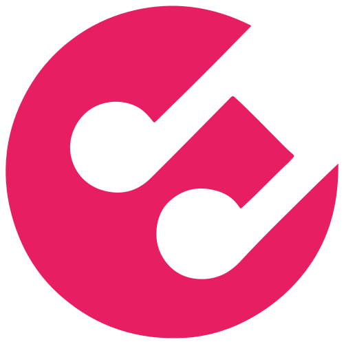

<div id="top"></div>

<br />
<div align="center">
  <a href="https://gama.academy">
    
  </a>

  <h3 align="center">Desafio Hacker Gama Experience - Grupo 11</h3>
   <p align="center">
    <a href="https://github.com/raphaelandrews">Raphael Andrews</a>
    ·
    <a href="https://github.com/lucaslirac">Lucas Lira</a>
  </p>
  
  <br>

  <p align="center">
     SoundGarden API
    
    <br />
    <br />
    <h4 align="center">Index</h4>
    <a href="#tada-live-preview"> :tada: Live Preview </a> .
    <a href="#scroll-features"> :scroll: Features </a> .
    <a href="#fire-clone-and-run"> :fire: Clone and Run </a> .
    <a href="#hammer-tools"> :hammer: Tools </a> 
  </p>
</div>

## :tada: Live Preview
[SoundGarden API](https://raphaelandrews.github.io/gama-experience-soundgarden/)

<br />

## :open_file_folder: About the Project


Essa é a nossa resposta ao Desafio Hacker da Gama Academy que consiste em requisições à API SoundGarden utilizando os métodos GET, POST, PUT e DELETE. 

<br />

## :scroll: Features

<ul>
 <li>Listar os eventos da API através do método GET</li>
 <li>Listar reservas dos eventos através do método GET</li>
 <li>Criação de eventos através do método POST</li>
 <li>Reservas ingresso através do método POST</li>
 <li>Atualização de eventos através do método PUT</li>
 <li>Deletar eventos através do método DELETE</li>
 <li>Exibição dos 3 últimos eventos em um banner rotativo</li>
</ul>

<br />

## :fire: Clone and Run
#### 1. Clone
```sh
$ git clone https://github.com/raphaelandrews/gama-experience-soundgarden.git
$ cd soundgarden-front-main
$ code .
```

#### 2. Run
```sh
Live Server Extension or open index.html
```

<br /> 

## :hammer_and_pick: Built With
<ul>
 <li>  HTML</li>
 <li>  CSS</li>
 <li>  JavaScript</li>
 <li>  Bootstrap</li>
 <li> :shield: Defensive CSS for dynamic content </li>
</ul>

<br />

## :handshake: Contributiros
<h4>Raphael Andrews</h4>

[![LinkedIn][linkedin-shield]][linkedin-url]
[![GitHub][github-shield]][github-url]


<h4>Lucas Lira</h4>

[![LinkedIn][linkedin-shield]][linkedin-url2]
[![GitHub][github-shield]][github-url2]

[github-shield]: https://img.shields.io/badge/github-%23121011.svg?style=for-the-badge&logo=github&logoColor=white
[linkedin-shield]: https://img.shields.io/badge/linkedin-%230077B5.svg?style=for-the-badge&logo=linkedin&logoColor=white
[linkedin-url]: https://www.linkedin.com/in/raphael-andrews/
[github-url]: https://github.com/raphaelandrews
[linkedin-url2]: https://www.linkedin.com/in/lucas-coutinho-686377138/
[github-url2]: https://github.com/lucaslirac
